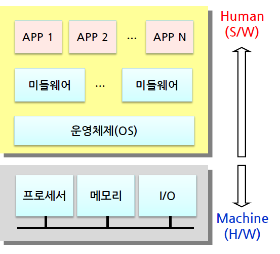

# 프로그램, 프로그래머, 소프트웨어 (2024. 01. 21.)

* 프로그램
    * pro(pre) + gram(grammer) : 먼저 적어놓은 것(메모리에)
    * CPU가 해야할 것을 미리 적어놓은 것
    * 클럭이 들어오면 명령어를 꺼내고 해석해서 실행하는 것
    * 1. fetch : 버스를 통해서 메모리에서 명렁어를 가져옴
    * 2. Decode : 명령어를 컴퓨터가 해석
    * 3. execute : 실행
    * CPU는 클럭에 맞춰서 1,2,3을 무한히 실행하는 역할

* 소프트웨어 : 프로그램 또는 프로그램 집합
    * 응용 소프트웨어(application)
    * 시스템 소프트웨어(운영체제와 그 주변의 것들)
        * 하드웨어 리소스를 최대한 효율적으로 관리하기 위함
    * 임베디드 소프트웨어(FalmWare)
        * 특정 하드웨어 기반으로 작동하도록
        * ROM에 구워져서 하드웨어에 들어감(수정하기가 어려움)

* 제품의 구성
    * 
    * 프로세서 : CPU
    * 운영체제 : **하드웨어를 최대한 효율적으로 돌리게 하는 역할.**
    * APP은 process이다. 프로그램과 프로세스의 차이는?
        * prcess : program in execution (실행중인 프로그램)
        * 로더가 SSD의 프로그램을 메모리에 적재하고, 그 프로그램의 시작 위치로 감(프로그램카운터라는 레지스터에 저장)

    * **AP** : OS를 탑재할 수 있는 processor
        * MMU(memory management unit)을 가지고 있어야함.
    * porting : 특정 하드웨어 환경에서 돌던 OS를 다른 하드웨어 상황으로 이식하는 것

* 하드웨어 플렛폼 구성요소
    * 메모리
        * 코드메모리(ROM) : 전원을 껐다가 켜도 그대로
        * 데이터메모리(RAM)
    * 한번의 클럭에 따라서
        1. fetch
            * 명령어를 코드메모리에서 가져온다.
            * 프로그램카운터(레지스터) 값을 address 버스에 띄워서 data버스로 명령어 받아서 저장
            * 코드 메모리가 4 증가하거나 jump
        2. decode
            * 명령어(어셈블리 ex) add r0, r0, #1 : and는 opcode, 나머지는 operand)
            * opcode와 operand를 기준으로 실행을 준비
        3. Execute : 실행
    * 디바이스제어(디바이스드라이버) -I/O를 CPU가 사용할 수 있게함
        * 메모리처럼 주소를 메핑해서 IO장치를 사용
    

ARM, LINUX